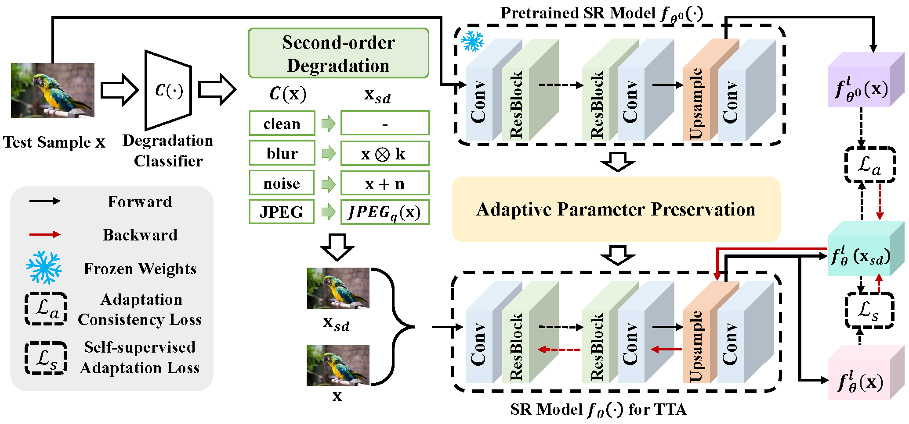

# Image Super-Resolution Test-Time Adaptation Framework (SRTTA)

## Overview
Image super-resolution (SR) aims to reconstruct high-resolution (HR) images from their low-resolution (LR) counterparts. While conventional SR methods use paired HR-LR training data synthesized via predefined degradation models (e.g., bicubic down-sampling), they often fail in real-world scenarios where degradation types dynamically change. This mismatch leads to suboptimal SR performance.

To address this issue, we use **SRTTA** (Super-Resolution Test-Time Adaptation), a novel framework that adapts SR models to diverse test domains with unknown degradation types efficiently. 

SRTTA:
- Adapts rapidly to dynamic domain shifts.
- Considers multiple degradation types (e.g., blur, noise, JPEG artifacts).
- Utilizes a second-order degradation scheme to construct paired data for adaptation.

## Key Features
- **Second-Order Degradation Scheme:** Constructs paired data based on the degradation type of the test image, predicted by a pre-trained degradation classifier.
- **Feature-Level Reconstruction Learning:** Adapts the SR model from the test image to its second-order degraded counterparts.
- **Loss Functions:** Combines L1 Charbonnier loss and image quality metric PIQE to compute loss for better SR results.

## Advantages
- Handles multiple degradation types effectively.
- Adapts quickly to new degradation types in test-time scenarios.
- Demonstrates significant performance improvement over existing methods.

## Dataset
Experiments were conducted on datasets DIV2KC and DIV2KMC.

SRTTA achieves impressive improvements in SR quality and speed compared to state-of-the-art methods.

## References

https://arxiv.org/abs/2310.19011
https://ieeexplore.ieee.org/document/7084843

